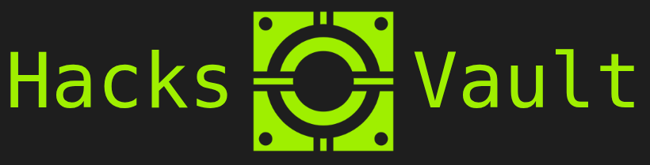

<!-- markdownlint-disable-next-line -->

<br><br>

# Hacks-Vault Jekyll Theme

Customized version of Chirpy theme to look more like a terminal

## Requirements

> Only required for local deployments

To deploy your site locally Jekyll must be installed in you system. You can find the instructions in the [Jekyll official documentation]((https://jekyllrb.com/docs/installation/)).

## Installation

There are two ways of using this theme. If you need to keep your site repository private, use the *Clone* option. You will not be able to use GitHub pages with the repo but you can still serve your site locally. In any other case, it is recommended to use *Fork* option.


|    |         Fork            |                 Clone                  |
|---:|:-----------------------:|:--------------------------------------:|
|Pros| Receive theme updates   | Repo may be public / private           |
|Cons| Repo **must** be public | No theme updates (fork linkage broken) |


### Fork

1. Create a new fork of this repository. Use the name you prefer for your Vault (may be changed later)
2. Clone the forked repository

```bash
git clone https://github.com/your-username/forked-repo.git
```

### Clone

```bash
YOUR_VAULT_NAME=""
# 1. Create a empty private repo in your account
# 2. Clone this repo
git clone https://github.com/uRHL/hacks-vault-theme.git $YOUR_VAULT_NAME$
cd $YOUR_VAULT_NAME
# 3. Update remote origin
git remote set-url origin https://github.com/your-username/private-repo.git
git push -u origin main
```

Once you have installed the theme:
1. Update the configuration (`_config.yml`) with your information (url, description, ...)
2. `_data/origin/authors.yml`
2. Delete example posts (`_posts` directory)

Done! You may start adding your content.

## Customizing your site

### Posts

Adding posts to a jekyll site is as easy as creating a specific file name: `%YYYY-%MM-%DD-your_post_title.md`. Then add the following Front-Matter:

```yml
---
title: Post title
categories: [main-cat, sub-cat] # lower-cased. Max sub-cat depth = 1
tags: [tag-1, tag-2, tag-n] # lower-cased. From 0 to infite values
---
```

Start writing the post content just after the Front-Matter. The post will be visible once you have deployed the changes.


### Tabs

Create a file `_tabs/tab_name.md` with the following Front-Matter:

```yml
---
# the default layout is 'page'
# icon: fas fa-info-circle  # Tabs icons are disabled in this theme
order: 4 # Display order in the sidebar
---
```

Now update `_data/locales/en.yml` (and/or the locale you want to use) adding the new tab into the `tabs` key (around line 10). For example: `donate: Donate`. 

Ready! The new tab will be displayed once you deploy the changes.

## Local deployment

> Ensure you have all the dependencies installed

If you plan to host the site yourself, or if you are modifiying your site and need to see the changes is real-time, you will need to run jekyll locally.

```bash
cd $YOUR_VAULT_NAME
bundle exec jekyll serve # Serve at 127.0.0.1:4000
```

## Setup GitHub pages

> If you are using a free account, you will not be able to host your site in GitHub pages if the repository is private. Thus first of all the repository must be public. If this is not the case, go to `Settings > Danger Zone > Change repository visibility`.

The recommended deployment option is `GitHub Actions`, although you can use the traditional way.
Go to `Settings > Pages`. Select `GitHub Actions`, then create a new workflow from `Jekyll` template. Ensure `main` branch is targeted in the workflow, then commit the workflow. 

Finally, ensure the environment configuration allows the workflow to be triggered on `main` branch. Go to `Settings > Environments > github-pages > Deployment branches and tags` then add `main` branch to the white-list.


Workflow and environment are now configured. Each time you push any change to the `main` branch your site will be automatically build and deployed.

## Changelog
- Favicon
  - Thanks to by [Viscious Speed](https://viscious-speed.deviantart.com/) and [Games-Icons](https://game-icons.net/).
- Font families (from [Google Fonts](https://fonts.google.com/))
  - Headings: _Anonymous Pro_ monospace
  - Text: _Fira Code_ monospace
  - Site title, Post title: _Workbench_ Sans-serif
- Color code
  - All clickable elements are green colored. When hover over them, they are highlighted in blue
- Sidebar
  - Animation: typing terminal like. Only triggered when loading HOME page
  - Avatar moded from sidebar to `About` page
  - Site title: change font to `Workbench`
  - Site subtitle: show terminal-like log messages. Add _blinking low-dash_ after last line 
  - Tabs
    - Add item selector `>` shown on hover
    - Change Icons by `$`
    - Active section blue color, inactive green
  - Contact
    - [ ] TODO: Add chip legs around contact elements
- Page
  - Move `Trending tags` from right-aside to `Tags`page
  - Add animated background _circuit animation_. Thanks to [Christopher Prins](https://codepen.io/christopherprins/pen/rZZWoj)
  - Change colors, round borders
- Post
  - Post metadata (header and footer) is now displayed using a terminal-like style
  - [ ] TODO: Add `TOC` again to post pages
- Search results
  - Change style to look like the home page

## TODOs

- [ ] Dockerize